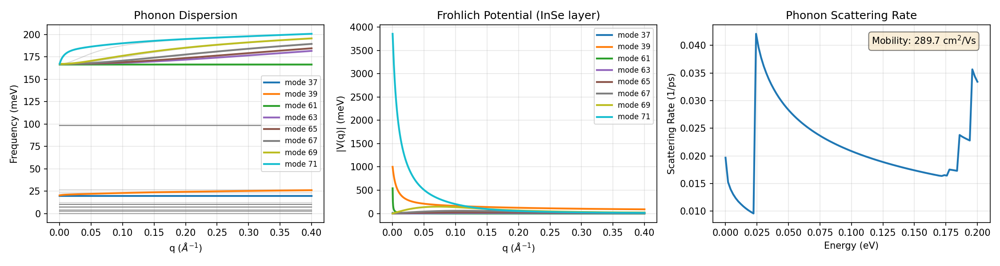
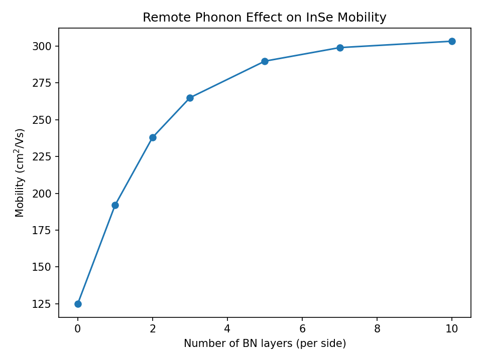
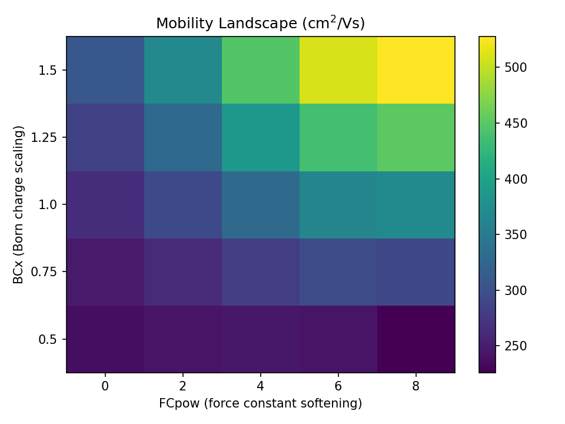

# qeh-frohlich

Phonon-limited carrier mobility in van der Waals heterostructures.

Extends the [QEH model](https://gitlab.com/camd/qeh) with Frohlich
electron-phonon coupling and Boltzmann transport calculations for 2D
semiconductors on dielectric substrates.

## Installation

```bash
git clone <repo-url>
cd qeh-frohlich
pip install .
```

## Quick Start

```python
from qeh_frohlich import FrohlichHeterostructure

# InSe encapsulated by 5 BN layers on each side
calc = FrohlichHeterostructure(
    layers=5 * ['BN+froh'] + ['InSe+froh'] + 5 * ['BN+froh'],
    effmass={'InSe': 0.192},
    mobility_layers=[5],
)
calc.run()
print(f"Mobility: {calc.mobility[0]:.1f} cm^2/Vs")
```

## Features

- Dielectric screening via QEH model (monopole + dipole susceptibilities)
- Frohlich coupling in three modes: isolated, phonon-normalized, coupled
- Phonon-limited mobility from Fermi's golden rule + relaxation time approximation
- Built-in data for 100+ 2D materials (TMDs, oxides, binary compounds)
- Equal-level access to: phonon dispersion, Frohlich potentials, scattering rates, mobility

## API

```python
calc = FrohlichHeterostructure(layers, effmass, mobility_layers)

# Full pipeline (runs all steps)
calc.run()

# Or call individual quantities (all at the same level)
calc.build()                       # Build heterostructure + screening
calc.get_dispersion()              # Phonon frequencies
calc.get_frohlich_potential()      # Coupling potentials V(q, nu)
calc.get_scattering_rates()        # Scattering rate vs energy
calc.get_mobility()                # Carrier mobility

# Access results as attributes
calc.dispersion    # {'qlen': array (Angstrom^-1), 'frequencies': array (meV)}
calc.frohlich      # {'qlen': array (Angstrom^-1), 'potentials': array (meV), 'frequencies': array (meV)}
calc.scattering    # {'energy': array (eV), 'rates': array (1/ps)}
calc.mobility      # list of floats (cm^2/Vs)
calc.het           # QEH Heterostructure object (for advanced use)
```

## Examples

Three runnable scripts in `examples/`:

**[01_heterostructure_analysis.py](examples/01_heterostructure_analysis.py)** --
Full diagnostic of a 5BN + InSe + 5BN heterostructure: phonon dispersion,
Frohlich coupling potentials, scattering rates, and mobility. Also compares
coupled vs isolated Frohlich potentials.



**[02_substrate_sweep.py](examples/02_substrate_sweep.py)** --
Sweeps the number of BN encapsulation layers (0 to 10 per side) and plots
mobility vs substrate thickness, showing the remote phonon effect.



**[03_parameter_scan.py](examples/03_parameter_scan.py)** --
Sensitivity analysis over Born charge scaling (BCx) and force constant
softening (FCpow) on a 3BN + InSe + 3BN structure. Produces a 2D mobility
heatmap.



## Layer Specification

Use the `+froh` modifier to indicate layers with phonon data for Frohlich coupling:

```python
layers = 5 * ['BN+froh'] + ['InSe+froh'] + 5 * ['BN+froh']
```

Other modifiers: `+doping=X,T=Y` (free carriers).

**Important**: Do NOT combine `+froh` with `+phonons` on the same layer.
The `+phonons` modifier (from the original QEH model) adds lattice
polarizability directly into the chi building block, which conflicts with
the Frohlich coupling model used in this package. An error will be raised
if both are used together.

## Bundled Materials

Over 100 materials with chi and phonon building blocks, including:
- TMDs: H-MoS2, H-MoSe2, H-WS2, H-WSe2, ...
- Oxides: T-GeO2, T-ZrO2, T-HfO2, T-SnO2, ...
- Binary: BN, InSe, GaSe, ...

## Adding New Materials

Each material needs two building-block files: a **phonon** file and a **chi**
(dielectric susceptibility) file.

### Phonon building block (`Material-phonons.npz`)

Generated from a Quantum ESPRESSO phonon calculation (`ph.x` with
`epsil=.true.`):

```python
from qeh_frohlich import dyn_qe2qeh
dyn_qe2qeh('material.dyn1', 'Material-phonons.npz')
```

### Chi building block (`Material-chi.npz`)

The chi file contains the monopole/dipole susceptibility of the isolated
monolayer and is produced by a GPAW linear-response calculation. Follow the
[QEH building-block tutorial](https://gpaw.readthedocs.io/tutorialsexercises/opticalresponse/qeh/qeh.html)
in the GPAW documentation, which walks through the full workflow:
ground-state DFT, linear-response calculation, and export to `chi.npz`.

### Using the new material

Place both files where Python can find them (the working directory or the
package data directory), then use `'Material+froh'` in your layer
specification:

```python
layers = ['Material+froh'] + 5 * ['BN+froh']
```

## Disclaimer

This package is developed and maintained by
[cz2014](https://github.com/cz2014). Code refactoring and documentation
were assisted by Claude (Anthropic). All physics implementations --
Frohlich coupling, dielectric screening, and mobility calculations --
are the responsibility of the author.

If you encounter issues with physical accuracy or have questions about
the methodology, please open an
[issue](https://github.com/cz2014/qeh-frohlich/issues) or contact the
author.

## License

GPLv3 (inherits from QEH model).

## References

If you use this package, please cite the following:

**QEH model (dielectric screening):**
```bibtex
@article{andersen2015dielectric,
  title={Dielectric genome of van der Waals heterostructures},
  author={Andersen, Kirsten and Latini, Simone and Thygesen, Kristian S},
  journal={Nano Letters},
  volume={15},
  number={7},
  pages={4616--4621},
  year={2015},
  publisher={ACS Publications}
}
```

**QEH v2 (phonons, substrates, doping):**
```bibtex
@article{gjerding2020efficient,
  title={Efficient ab initio modeling of dielectric screening in 2D van der Waals materials: Including phonons, substrates, and doping},
  author={Gjerding, MN and Cavalcante, LSR and Chaves, Andrey and Thygesen, KS},
  journal={The Journal of Physical Chemistry C},
  volume={124},
  number={21},
  pages={11609--11616},
  year={2020},
  publisher={ACS Publications}
}
```

**Frohlich coupling and remote phonon scattering:**
```bibtex
@article{zhang2024anomalous,
  title={Anomalous enhancement of carrier mobility by remote phonons},
  author={Zhang, Chenmu and Liu, Yuanyue},
  journal={arXiv preprint arXiv:2404.08114},
  year={2024}
}
```
